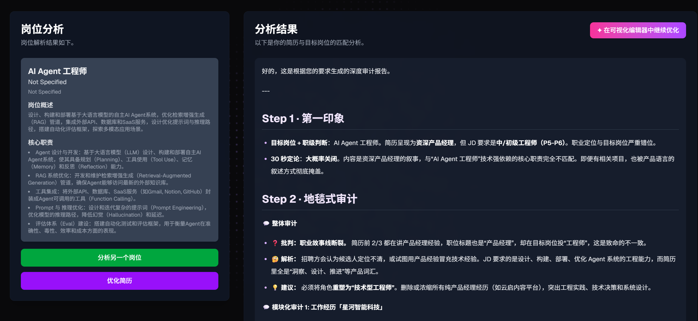
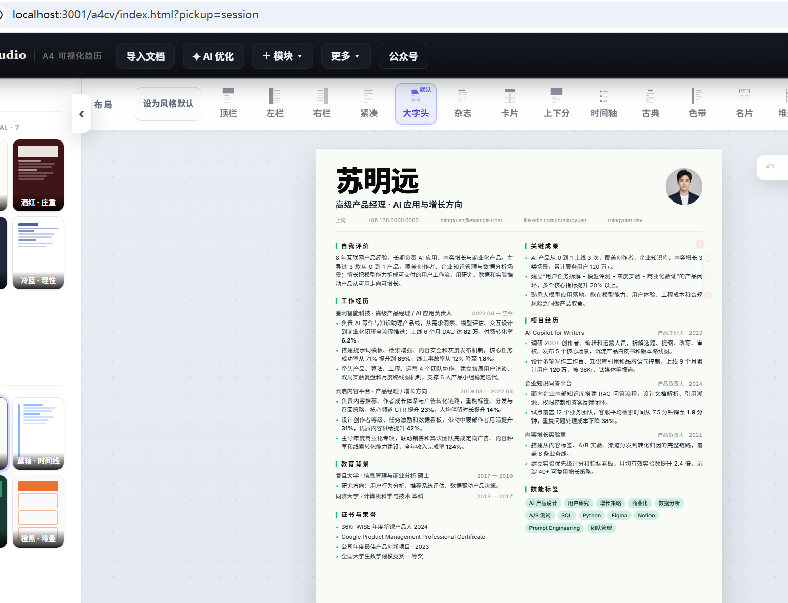

# HR批评简历

HR批评简历是一个面向中文用户的 AI 简历深度优化工具。上传简历并粘贴目标岗位 JD 后，系统会解析简历与岗位要求，生成岗位匹配分析、HR 视角审计报告和可执行的简历修改建议。

本项目采用 **Flask + JSON 文件存储** 的极简架构——无需安装任何数据库、零数据库运维，简历与 JD 直接存为 JSON 文件。适合个人/小团队本地使用、轻量服务器部署、Docker 容器化交付。

本项目整合了阿真的开源简历编辑器 a4cv：https://github.com/irenerachel/a4cv

## 目录

- [核心功能](#核心功能)
- [技术栈](#技术栈)
- [实际效果](#实际效果)
- [目录结构](#目录结构)
- [环境要求](#环境要求)
- [快速开始](#快速开始)
  - [方式 A：Docker Compose（推荐）](#方式-adocker-compose推荐)
  - [方式 B：本地源码运行（适合开发）](#方式-b本地源码运行适合开发)
- [环境变量](#环境变量)
- [常用命令](#常用命令)
- [验证安装](#验证安装)
- [使用流程](#使用流程)
- [**服务器部署** ➜](./docs/SERVER_DEPLOY.md) ⭐️️
  - 完整的 Linux 部署指南（12 章 / ~900 行）：Docker、源码、systemd、Nginx、HTTPS、备份、监控、调优、排查
- [**宝塔面板部署** ➜](./docs/BAOTA_DEPLOY.md)
- [API 概览](#api-概览)
- [端到端测试](#端到端测试)
- [可视化编辑器集成（a4cv）](#可视化编辑器集成a4cv)
- [常见问题](#常见问题)
- [说明与致谢](#说明与致谢)

## 核心功能

- 上传 PDF / DOCX 简历并提取文本
- 粘贴岗位 JD 并解析岗位职责、要求和关键词
- 使用 OpenAI 兼容 API 进行结构化抽取与简历审计
- 生成中文 HR 视角的深度简历分析报告
- 根据岗位要求输出简历优化方向和示例改写
- 一键把优化后的简历送入 a4cv 可视化编辑器二次微调
- 流式输出分析进度（SSE），不卡顿
- 前端界面已中文化，适合中文求职场景

## 技术栈

| 模块 | 技术 |
| --- | --- |
| 前端 | Next.js 15、React 19、TypeScript、Tailwind CSS |
| 后端 | Flask、Gunicorn（同步，宝塔/服务器原生支持，无 ASGI 坑） |
| 存储 | **JSON 文件**（无数据库，零运维，原子写） |
| AI 接入 | 任意 OpenAI 兼容 API（智谱、DeepSeek、Tencent TokenHub 等） |
| 默认模型 | `glm-5.1`，可在 `.env` 改 `LLM_MODEL` / `LLM_BASE_URL` |
| 文档解析 | `pdfminer.six` 解析 PDF，标准库解析 DOCX（支持双列布局） |
| 部署 | Docker Compose / 源码 + Nginx + systemd |

## 实际效果




## 目录结构

```text
.
├── apps/
│   ├── backend/              # Flask 后端（极简，7 个文件）
│   │   ├── app.py            # Flask 应用 + 全部路由（7 endpoints + /ping）
│   │   ├── config.py         # 配置（os.getenv + dotenv）
│   │   ├── llm.py            # OpenAI 调用 + 平衡括号 JSON 解析
│   │   ├── parser.py         # PDF/DOCX 文本提取
│   │   ├── prompts.py        # 3 个提示词模板
│   │   ├── store.py          # JSON 文件存储（原子写、None 回退）
│   │   ├── run.py            # 本地开发启动入口
│   │   ├── data/             # JSON 数据（自动生成）
│   │   ├── .env.sample       # 后端环境变量示例
│   │   └── requirements.txt  # 仅 5 个依赖
│   └── frontend/             # Next.js 前端
│       ├── app/              # 页面路由
│       ├── components/       # UI 与业务组件
│       ├── lib/api/          # 前端 API 客户端
│       └── public/a4cv/      # a4cv 编辑器静态资源
├── docs/
│   ├── BAOTA_DEPLOY.md       # 宝塔部署指南
│   └── a4cv-integration/     # a4cv 集成资料
├── docker-compose.yml
├── .dockerignore
└── package.json
```

## 环境要求

### Docker 方式

- Docker Desktop 或 Docker Engine 20.10+
- Docker Compose v2（`docker compose` 命令，非旧版 `docker-compose`）
- 一个 OpenAI 兼容 API Key

### 本地源码方式

| 工具 | 最低版本 | 说明 |
| --- | --- | --- |
| Node.js | 20 LTS+ | 前端构建 |
| Python | 3.12+ | 后端运行 |
| pip | 随 Python 自带 | 装后端依赖 |
| npm | 随 Node 自带 | 装前端依赖 |

> 后端只用标准 `pip install -r requirements.txt`，不需要 uv / poetry 等包管理器。

## 快速开始

### 方式 A：Docker Compose（推荐）

```bash
cp apps/backend/.env.sample apps/backend/.env
```

编辑 `apps/backend/.env`，至少填写：

```env
ENV="production"
SESSION_SECRET_KEY="change-me-to-a-random-string"
LLM_API_KEY="your-llm-api-key"
LLM_BASE_URL="https://open.bigmodel.cn/api/paas/v4/"
LLM_MODEL="glm-5.1"
```

> **必填**：`LLM_API_KEY`。生产部署（`ENV=production`）下，`LLM_API_KEY` 为空或 `SESSION_SECRET_KEY` 仍为 `change-me` 时，后端会**拒绝启动**。

> 💡 **小贴士**：`.env` 里的值带不带引号都行（如 `LLM_API_KEY="sk-xxx"` 和 `LLM_API_KEY=sk-xxx` 等效），Docker Compose 和本地都能正确识别。若不建 `.env` 直接启动，后端会以 `ENV=local` 运行（可正常跑，但建议填 Key 以使用 AI 功能）。

启动：

```bash
docker compose up --build -d
```

访问：

- 前端：http://localhost:3000
- 后端：http://localhost:8000
- 健康检查：http://localhost:8000/ping （返回 `{"message":"pong",...}`）

> 后端容器健康检查用 Python 探测 `/ping`（slim 镜像无 curl）。`STATUS` 显示 `healthy` 即服务就绪；启动初期可能短暂显示 `health: starting`，属正常。

查看日志 / 停止：

```bash
docker compose logs -f          # 跟日志
docker compose logs backend     # 只看后端
docker compose down             # 停止（数据保留在 named volumes）
docker compose down -v          # 停止并删除数据
```

Docker 把数据 / 日志保存在 named volumes：`backend-data`、`backend-logs`。

### 方式 B：本地源码运行（适合开发）

```bash
cp apps/backend/.env.sample apps/backend/.env
cp apps/frontend/.env.sample apps/frontend/.env
```

编辑 `apps/backend/.env` 填 `LLM_API_KEY`。本地开发时 `apps/frontend/.env` 默认即可：

```env
NEXT_PUBLIC_API_URL="http://127.0.0.1:8000"
```

```bash
npm run setup     # 装根目录 + 前端 + 后端依赖
npm run dev       # 同时启前后端
```

- 前端：http://localhost:3000
- 后端：http://localhost:8000

> **自定义前端端口**：默认 3000，修改用 `npm run dev:frontend -- -p 3001`，后端 CORS 默认放行 3000-3002。

## 环境变量

### 后端：`apps/backend/.env`

| 变量 | 必填 | 默认值 | 说明 |
| --- | --- | --- | --- |
| `ENV` | 否 | `local` | `local` / `production`；production 强制校验 Key/密钥 |
| `SESSION_SECRET_KEY` | production 必填 | `change-me` | Session 签名密钥，production 下不能是默认值 |
| `LLM_API_KEY` | **是** | 空 | OpenAI 兼容 API Key |
| `LLM_BASE_URL` | 是 | 智谱 API | OpenAI 兼容 API Base URL |
| `LLM_MODEL` | 是 | `glm-5.1` | 模型名称（兼容 `LL_MODEL` 老命名） |
| `BACKEND_PORT` | 否 | `8000` | 本地 `run.py` 监听端口 |
| `ALLOWED_ORIGINS` | 否 | 本地端口 | CORS 来源，逗号分隔；同源反代留空 |
| `LOG_DIR` | 否 | `apps/backend/logs` | 日志目录，服务器建议用绝对路径 |

> 兼容说明：`LL_MODEL`（历史命名）仍可识别，建议用 `LLM_MODEL`（标准命名）。

### 前端：`apps/frontend/.env`

| 变量 | 示例 | 说明 |
| --- | --- | --- |
| `NEXT_PUBLIC_API_URL` | `http://127.0.0.1:8000` | 浏览器请求后端 API 的基础地址 |

取值规则：

- **未设置或空字符串** → 走相对路径 `/api/...`，**适合 Docker / nginx 同源反代**
- 显式设值 → 走绝对 URL，适合跨域调试

> 跨域部署时：把前端实际域名加进后端 `ALLOWED_ORIGINS`。同源反代部署则不需要 CORS 配置。

## 常用命令

```bash
npm run setup            # 安装根目录、前端和后端依赖
npm run dev              # 同时启动前端和后端开发服务
npm run dev:frontend     # 只启动前端
npm run dev:backend      # 只启动后端
npm run build            # 构建前端 + 后端编译检查
npm run start            # 生产模式启动前后端
npm run lint             # 前端 ESLint
npm run test:e2e:fast    # 后端快速冒烟测试（不调用 LLM）
npm run test:e2e         # 后端完整 E2E（会调用 LLM）
npm run docker:up        # docker compose up
npm run docker:down      # docker compose down
```

## 验证安装

```bash
curl http://127.0.0.1:8000/ping
# 期望返回 {"message":"pong","database":"reachable"}
```

代码检查：

```bash
npm run lint
npm run build
cd apps/backend && python -m compileall app.py config.py llm.py parser.py prompts.py run.py store.py
```

## 使用流程

1. 打开前端页面。
2. 上传 PDF 或 DOCX 简历。
3. 页面跳转到岗位描述输入页。
4. 粘贴目标岗位 JD。
5. 点击"下一步"提交岗位描述。
6. 点击"开始优化"生成分析结果（流式进度条）。
7. 查看岗位解析、简历审计报告和优化建议。
8. 点击"在可视化编辑器中继续优化"，送入 a4cv 编辑器继续微调。

---

## 服务器部署

> 完整的 Linux 服务器部署指南（Docker / 源码 / Nginx / HTTPS / 备份 / 监控 / 升级 / 性能调优 / 排查）已抽出到独立文档：
>
> 👉 **[`docs/SERVER_DEPLOY.md`](./docs/SERVER_DEPLOY.md)** — 12 个章节、约 900 行实操指南。
>
> 宝塔面板用户请看 **[`docs/BAOTA_DEPLOY.md`](./docs/BAOTA_DEPLOY.md)**。

下方仅列出**最关键的 5 步快速上线**（生产环境强烈建议看完整文档）：

```bash
# 1. 准备环境（Ubuntu 22.04 为例）
sudo apt update && sudo apt install -y python3.12 python3.12-venv nodejs npm nginx
curl -fsSL https://get.docker.com | sudo sh

# 2. 拉代码并配置
sudo mkdir -p /opt/resume-matcher && sudo chown ${USER}:${USER} /opt/resume-matcher
cd /opt/resume-matcher && git clone <仓库地址> .
cp apps/backend/.env.sample apps/backend/.env && vim apps/backend/.env

# 3. 启动（Docker 方式最快）
docker compose up -d --build

# 4. 验证
curl http://127.0.0.1:8000/ping
curl -I http://127.0.0.1:3000

# 5. Nginx 反代 + HTTPS：详见 SERVER_DEPLOY.md 第 5 节
```

详细：硬件要求、systemd 服务化、Let's Encrypt、防火墙、备份、日志、监控、升级回滚、性能调优、问题排查 → **[`docs/SERVER_DEPLOY.md`](./docs/SERVER_DEPLOY.md)**

---

## API 概览

### 简历接口

- `POST /api/v1/resumes/upload`：上传并解析简历（multipart/form-data，字段名 `file`）
- `GET  /api/v1/resumes?resume_id=...`：获取简历数据
- `POST /api/v1/resumes/improve`：根据岗位描述生成简历分析与优化建议
- `POST /api/v1/resumes/improve?stream=true`：流式返回分析过程（SSE）
- `POST /api/v1/resumes/improved-markdown`：提取或重建可导入 a4cv 的 Markdown

### 岗位接口

- `POST /api/v1/jobs/upload`：上传并解析岗位描述
- `GET  /api/v1/jobs?job_id=...`：获取岗位解析结果

### 系统接口

- `GET  /ping`：健康检查

## 端到端测试

后端内置 stdlib-only 的端到端冒烟测试。

运行前提：

- 后端已在 `http://127.0.0.1:8000` 运行。
- 项目根目录存在默认样本简历 `苏明远2-简历-20260615.docx`，或通过参数指定其他简历。
- 完整测试需要可用的 `LLM_API_KEY`。

快速测试（不调 LLM）：

```bash
npm run test:e2e:fast
```

完整测试：

```bash
npm run test:e2e
```

自定义参数：

```bash
python apps/backend/test_e2e.py \
  --base-url http://127.0.0.1:8001 \
  --frontend-url http://127.0.0.1:3001 \
  --resume-file /path/to/your.docx
```

## 可视化编辑器集成（a4cv）

[a4cv](https://github.com/irenerachel/a4cv) 是一个独立的中文可视化简历编辑器。本项目将编辑器静态资源放在 `apps/frontend/public/a4cv/`，由 Next.js 同源托管。

数据流：

```text
dashboard 点击按钮
   └─► POST /api/v1/resumes/improved-markdown
         └─► 从 analysis_result 抽取 Markdown 或重建 fallback
   └─► sessionStorage.setItem('pendingResumeMD', md)
   └─► window.open('/a4cv/index.html?pickup=session')
         └─► a4cv 读取 sessionStorage 并渲染
```

## 常见问题

### `LLM_API_KEY` 为空或模型调用失败

确认已经复制 `apps/backend/.env.sample` 到 `apps/backend/.env`，并填写了有效 Key。Docker 方式也读取同一个文件。

### 前端提示连接后端失败

本地开发检查 `apps/frontend/.env`：

```env
NEXT_PUBLIC_API_URL="http://127.0.0.1:8000"
```

服务器部署时，`NEXT_PUBLIC_API_URL` 必须是浏览器能访问到的地址；同源 nginx 反代部署则设为空字符串。

### 浏览器控制台报 CORS

如果前后端不同源访问，需要把前端域名加入后端 `ALLOWED_ORIGINS`。同源 nginx 反代部署不需要 CORS。

### a4cv 编辑器打开后是空白

确认路径是 `/a4cv/index.html?pickup=session`，并检查浏览器 console 是否提示未找到 `pendingResumeMD`。

### `npm run lint` 扫描构建产物

当前 ESLint 已忽略 `.next/`、`out/` 和 `public/a4cv/`。如果仍报构建产物错误，先删除 `apps/frontend/.next` 后重试。

## 说明与致谢

本项目基于开源项目 `srbhr/Resume-Matcher` 二次开发，针对中文求职和国内模型调用场景做了调整：

- 移除本地 Ollama / 本地 embedding provider
- 移除 MarkItDown 等重依赖
- 默认使用智谱 OpenAI 兼容 API
- **存储改用 JSON 文件**（替代原 SQLite，零数据库运维）
- 前端界面中文化
- 重构后端为 Flask 极简架构（7 个文件、5 个依赖）
- 集成 a4cv 可视化编辑器

提示词模板参考中文 HR / 面试官视角的简历审计风格，用于输出更直接、更适合修改简历的建议。

感谢 a4cv 项目和 https://linux.do 社区佬友支持。
